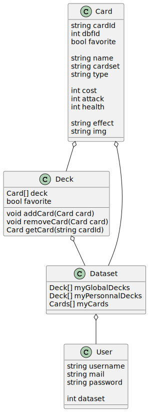

# Hearthstone Card Manager

Ce projet est une application de gestion de Carte du jeu HearthStone.
Danc cet application il est possible de ce connecter, crée un compte, ajouter des carte à son decks, supprimer des cartes de son deck, exporter la carte en Json grace à qr code, afficger quelques détails de la carte, acceder à son profil, voir sa localisation

## Description

## Analysis

## Conception

